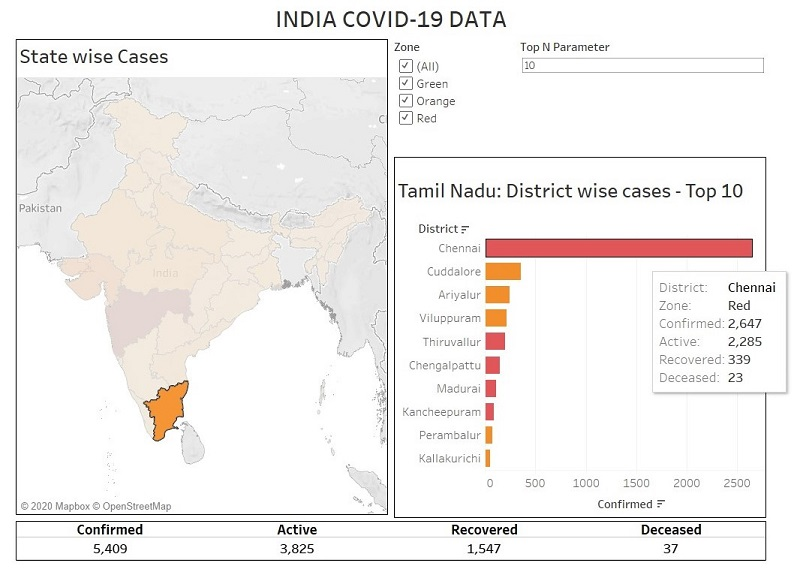

**INDIA-COVID-19-DATA**

***Extracting and visualizing the covid-19 data of India using Python.***

This is a set of code you can use to extract and visualize the covid data from the json file provided at:
https://api.covid19india.org/ (Thanks to the respective developers).

1. [read_data.py](read_data.py) extracts the covid-19 data from the json file and saves it in a SQLite database 'covid_cases.sqlite'.

    Output: **Data Retrieved** shows that the code was successfull extracting the covid data from the json file.

2. [read_zones.py](read_zones.py) extracts the Zone of each district and updates the data to the SQLite database 'covid_cases.sqlite'.
    Both these codes models the data so that it takes minimal space i.e. no replica of data is saved in the database,
    for example, States, Districts, Zones, etc.

    Output: **Updated Zone data** shows that the code was successfull extracting the zone data of each district from the json file and
    updating the database.

These codes collects data directly from the link, if required it can be modified to obtain data from json file stored offline.

Download the **DB Browser (SQLite)** to view the database '[covid_cases.sqlite](covid_cases.sqlite)'.
You can download the brower from:
http://sqlitebrowser.org/

3. Run [find_data.py](find_data.py) to look through the database and view the COVID-19 cases in the country, state-wise and ditrict-wise. The code will run you through the database as per your requirement.

If you just want to look through the data, you can download the '[covid_cases.sqlite](covid_cases.sqlite)' and directly run the
[find_data.py](find_data.py) file. But the provided database will contain only COVID19 data until 8th May 2020 - IST 05:00 P.M. If you
want to update the recent data, run read_data.py and read_zones.py files first and then run the find_data.py file.

If you require, you can alter the [find_data.py](find_data.py) to visualize the data as per your requirement.

4. I have also provided the [extract_data.py](extract_data.py) file which you can use to extract and save the data as a .csv file. 
You can use that as well to visualize the data using Excel or any other suitable tools as per your requirement. I used the data in
[Tableau software](https://www.tableau.com/) to create a sample visualization. A few [sample snipets](visualization_sample) are
provided. 

You can download and reuse the codes as per your requirements, but if your publishing or sharing the work please provide the reference
link as:
**https://github.com/rohith-s-p/INDIA-COVID-19-DATA**

--ROHITH S P
