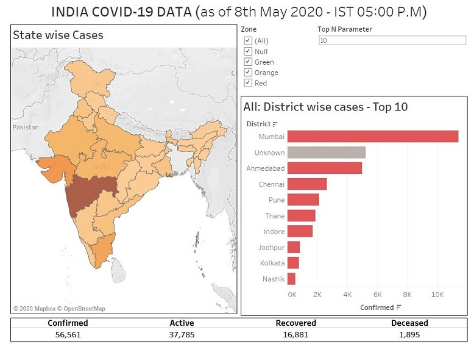
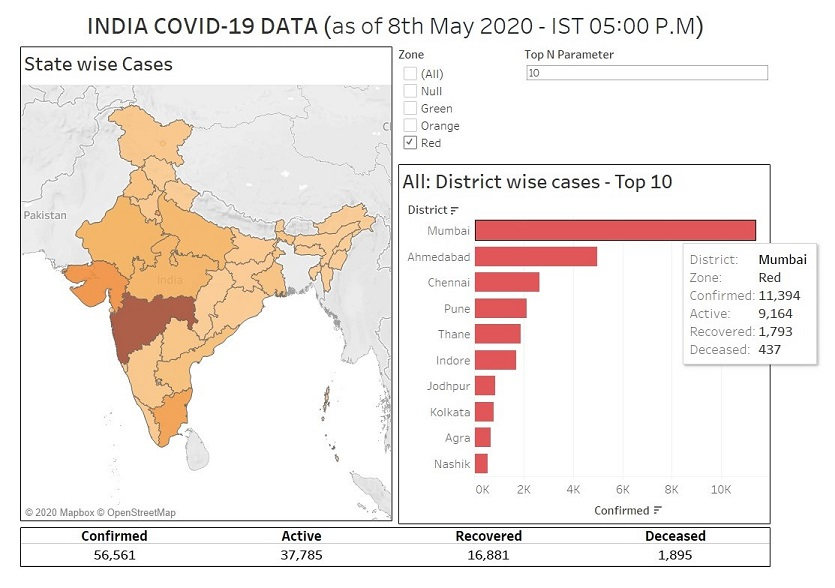
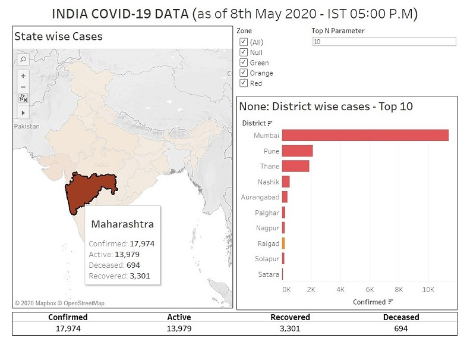
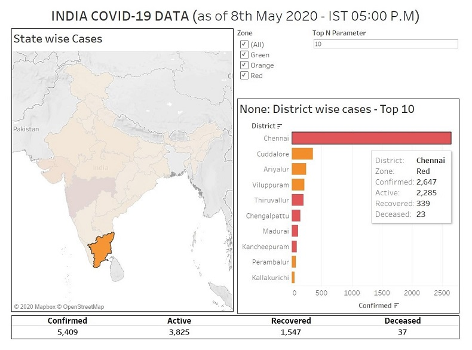
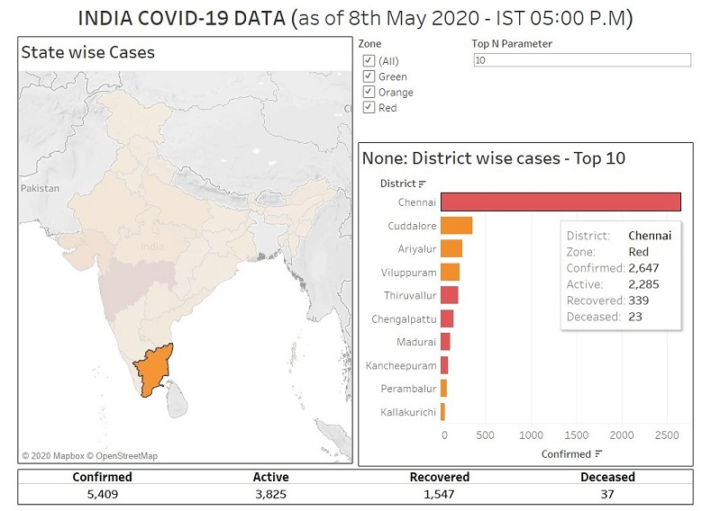

[Try the visualization dashboard online](https://public.tableau.com/profile/rohith.s.p#!/vizhome/Indiacovid-19data/covid19data){:target="_blank"}.

Download the Tableau Packaged Workbook, [visualize_covid_data.twbx](visualize_covid_data.twbx) and try it out using [Tableau Desktop](https://www.tableau.com/en-in/products/desktop) or for free using the [Tableau Reader](https://www.tableau.com/en-in/products/reader) to visualize the data. The following are a few sample screenshots:

**SAMPLE_1**

  

**SAMPLE_2**

  

**SAMPLE_3**

  

**SAMPLE_4**

  

**SAMPLE_5**

  

